# .NET DLLs for Azure Machine Learning Studio management

## Overview

### Description

This repository contains a proof of concept project for **[Azure Machine Learning Studio](https://docs.microsoft.com/en-us/azure/machine-learning/studio/what-is-ml-studio)** management.

The solution includes **[.NET Standard 2.0](https://docs.microsoft.com/en-us/dotnet/standard/net-standard)** Class Libraries (*DLLs*),
which can be incorporated in many .NET applications and be used for scale and automate Azure ML Studio workspaces and experiments.

:construction: At the moment, the project is in the pre-release phase - __be aware of possible errors and exceptions before using it!__ :construction:

### Solution Base Overview

The idea of creating a tool to manage Azure Machine Learning Studio was born during the meeting with our partner **[Soneta/Enova365](https://www.enova.pl/en/)**.

Our partner was looking for solutions that could help automate and scale experiments in Azure ML Studio portal.
After the initial analysis of the available tools, I discovered the only one
that I used later as a base for the current solution
(*source: [PowerShell Module for Azure Machine Learning Studio & Web Services](https://github.com/hning86/azuremlps)*) - this solution was developed for PowerShell users, and the C# code implementation (SDK) helped me as a base to create this project.

## Table of Contents

- [Project](#net-dlls-for-azure-machine-learning-studio-management)  
- [Overview](#overview)  
  - [Description](#description)  
  - [Solution Base Overview](#solution-base-overview)  
- [Table of Contents](#table-of-contents)  
- [Prerequisites](#prerequisites)
  - [Azure Machine Learning Studio](#azure-machine-learning-studio)
    - [Free Workspace](#free-workspace)
    - [Azure Subscription](#azure-subscription)
  - [Software](#software)
  - [Tools & Libraries](#tools-libraries)
- [Usage](#usage)
- [Testing](#testing)
- [Learnings](#learnings)
- [Credits](#credits)
- [Helpful Materials](#helpful-materials)

## Prerequisites

### Azure Machine Learning Studio

This solution was created for the use of Azure Machine Learning Studio resources - *Workspace, Experiment, Database, Modules, etc.*
We need a proper account to be able to work by using this library.

We can create different types of workspaces, because our library should deal with any type of account.

#### Free Workspace

Visit the main website of Azure Machine Learning Studio and simply create a new account - https://studio.azureml.net/

You should notice this:


#### Azure Subscription

Alternatively, create an Azure Account with a subscription.

- [Azure Free Account](https://azure.microsoft.com/en-us/offers/ms-azr-0044p/)
- [Azure for Students](https://azure.microsoft.com/en-us/free/students/)
- [Azure Pass](https://www.microsoftazurepass.com/Home/HowTo)

And create a workspace withing the portal:


### Software

***AzureML.Studio.dll*** and ***AzureML.Studio.Core.dll*** are class libraries written in .NET Standard 2.0 .

*"The .NET Standard is a formal specification of .NET APIs that are intended to be available on all .NET implementations.
The motivation behind the .NET Standard is establishing greater uniformity in the .NET ecosystem.
ECMA 335 continues to establish uniformity for .NET implementation behavior,
but there is no similar spec for the .NET Base Class Libraries (BCL) for .NET library implementations."*

You can use these DLLs in particluar, however before using concider the following table of all versions of .NET Standard and the platforms supported (*source: [.NET Standard](https://docs.microsoft.com/en-us/dotnet/standard/net-standard#net-platforms-support)*):

| **.NET Standard**             | **1.0** | **1.1** | **1.2** | **1.3** | **1.4** | **1.5** | **1.6** | **2.0** |
| :---------------------------- | :-----: | :-----: | :-----: | :-----: | :-----: | :-----: | :-----: | :-----: |
| .NET Core                     | 1.0     |	1.0 	| 1.0 	  | 1.0 	| 1.0 	  | 1.0 	| 1.0 	  | 2.0     |
| .NET Framework                | 4.5     |	4.5     | 4.5.1   | 4.6     | 4.6.1   |	4.6.1   | 4.6.1   |	4.6.1   |
| Mono                          | 4.6     |	4.6     | 4.6 	  | 4.6     | 4.6     |	4.6     | 4.6     |	5.4     |
| Xamarin.iOS                   | 10.0    |	10.0    | 10.0    |	10.0    | 10.0    |	10.0 	| 10.0    |	10.14   |
| Xamarin.Mac                   | 3.0     |	3.0     | 3.0     |	3.0     | 3.0     |	3.0 	| 3.0     |	3.8     |
| Xamarin.Android               | 7.0 	  | 7.0     | 7.0 	  | 7.0 	| 7.0     |	7.0     | 7.0     |	8.0     |
| Universal Windows Platform    | 10.0    | 10.0    | 10.0    | 10.0    | 10.0 	  | 10.0.16299 | 10.0.16299 | 10.0.16299 |

### Tools & Libraries

You may need such tools as code-editors, IDEs or notepads, and libraries through which you can create a .NET application.
In that case, I used Visual Studio with proper frameworks to run a Console Application as an example.

- [Visual Studio IDE](https://www.visualstudio.com/vs/)

## Usage

### NuGet

- AzureML.Studio - https://www.nuget.org/packages/AzureML.Studio/
- AzureML.Studio.Core - https://www.nuget.org/packages/AzureML.Studio.Core/

### Release

- GitHub - https://github.com/borysrybak/azure-machine-learning-studio/releases

### Requirements

(*from source: https://github.com/hning86/azuremlps#configuration*):
- **Workspace ID**
  - This value can be found in Workspace Settings in ML Studio.

  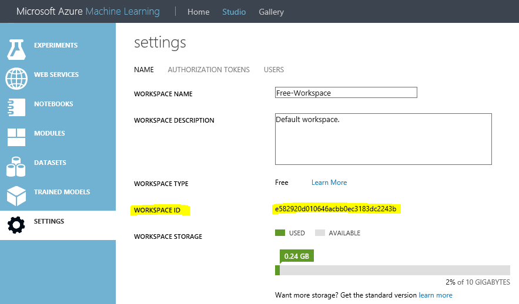

- **Workspace Authorization Token**
  - This value can be found in Workspace Settings in ML Studio. Note you must be an Owner of the Workspace in order to have access to this token.

  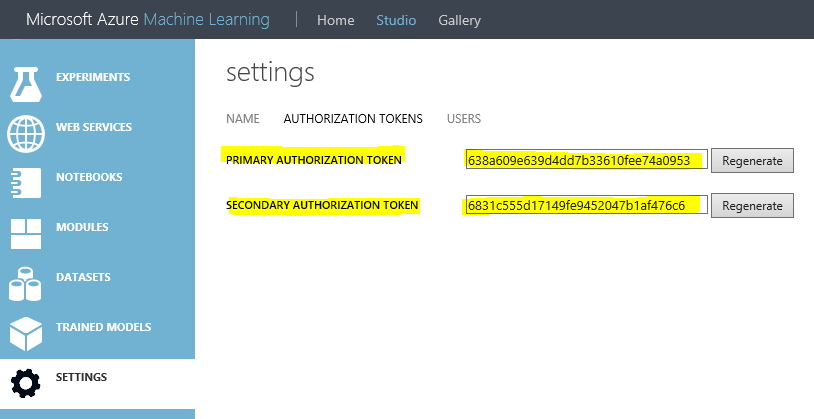

- **Location**
  - This value can be found in the Workspace drop-down. It is the Azure region the Workspace is provisioned in. Currently supported values for this configuration are:
    - South Central US (use this value for all Free Workspaces)
    - Southeast Asia
    - Japan East
    - West Europe
    - West Central US
    - ...

  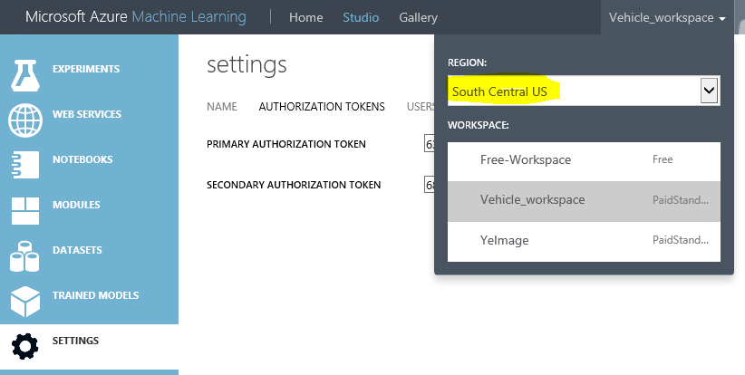

### Configuration

- Add reference or install as a NuGet package to your project.

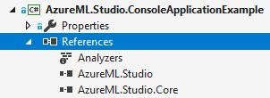

- Create an instance of StudioClient class and use it.

```csharp
using AzureML.Studio.Core.Models;

namespace AzureML.Studio.ConsoleApplicationExample
{
    class Program
    {
        static void Main(string[] args)
        {
            var studioClient = new StudioClient();
            
            var workspaceSettings = WorkspaceSettings();
            workspaceSettings.WorkspaceId = "XYZ";
            workspaceSettings.AuthorizationToken = "######";
            workspaceSettings.Location = "";

            var workspace = studioClient.GetWorkspace(workspaceSettings);
        ...
    ...
}
```

### Operations

- Get Workspace metadata ([_GetWorkspace_](#GetWorkspace))
- Get selected Workspaces metadata ([_GetWorkspaces_](#GetWorkspaces))
- Get Users of the Workspace ([_GetWorkspaceUsers_](#GetWorkspaceUser))
- Get Users from selected Workspaces ([_GetWorkspacesUsers_](#GetWorkspacesUsers))
- Add a new User to Workspace  ([_AddUserToWorkspace_](#AddUserToWorkspace))
- Add a new User to selected Workspaces  ([_AddUserToWorkspaces_](#AddUserToWorkspaces))
- Add new users to Workspace ([_AddUsersToWorkspace_](#AddUsersToWorkspace))
- Add new users to selected Workspaces ([_AddUsersToWorkspaces_](#AddUsersToWorkspaces))
- Get Datasets from a Workspace ([_GetDatasetsFromWorkspace_](#GetDatasetsFromWorkspace))
- Get Datasets for selected Workspaces ([_GetDatasetsFromWorkspaces_](#GetDatasetsFromWorkspaces))
- Delete a Dataset from a Workspace ([_DeleteDatasetFromWorkspace_](#DeleteDatasetFromWorkspace))
- Delete Datasets from a Workspace ([_DeleteDatasetsFromWorkspace_](#DeleteDatasetsFromWorkspace))
- Delete all Datasets from a Workspace ([_DeleteAllDatasetsFromWorkspace_](#DeleteAllDatasetsFromWorkspace))
- Delete all Datasets from selected Workspaces ([_DeleteAllDatasetsFromWorkspaces_](#DeleteAllDatasetsFromWorkspaces))
- Download a Dataset from a Workspace ([_DownloadDatasetFromWorkspace_](#DownloadDatasetFromWorkspace))
- Download selected Datasets from a Workspace ([_DownloadDatasetsFromWorkspace_](#DownloadDatasetsFromWorkspace))
- Download all Datasets from a Workspace ([_DownloadAllDatasetsFromWorkspace_](#DownloadAllDatasetsFromWorkspace))
- Download all Datasets from selected Workspaces ([_DownloadAllDatasetsFromWorkspaces_](#DownloadAllDatasetsFromWorkspaces))
- Upload resource file to a Workspace ([_UploadResourceToWorkspace_](#UploadResourceToWorkspace))
- Upload resource files to a Workspace ([_UploadResourcesToWorkspace_](#UploadResourcesToWorkspace))
- Upload resource file to Workspaces ([_UploadResourceToWorkspaces_](#UploadResourceToWorkspaces))
- Upload resource files to Workspaces  ([_UploadResourcesToWorkspaces_](#UploadResourcesToWorkspaces))
- Get an Experiment by id ([_GetExperiment_](#GetExperiment))
- Get Experiments by ids ([_GetExperiments_](#GetExperiments))
- Get all Experiments from a Workspace ([_GetAllExperiments_](#GetAllExperiments))
- Run an Experiment ([_RunExperiment_](#RunExperiment))
- Run Experiments ([_RunExperiments_](#RunExperiments))
- Run all Experiments ([_RunAllExperiments_](#RunAllExperiments))
- Save an Experiment ([_SaveExperiment_](#SaveExperiment))
- Save Experiments ([_SaveExperiments_](#SaveExperiments))
- Save all Experiments ([_SaveAllExperiments_](#SaveAllExperiments))
- Save an Experiment as ([_SaveExperimentAs_](#SaveExperimentAs))
- Delete an Experiment ([_DeleteExperiment_](#DeleteExperiment))
- Delete Experiments ([_DeleteExperiments_](#DeleteExperiments))
- Delete all Experiments ([_DeleteAllExperiments_](#DeleteAllExperiments))
- Export an Experiment as JSON ([_ExportExperiment_](#ExportExperiment))
- Export specific Experiments as JSON ([_ExportExperiments_](#ExportExperiments))
- Export all Experiments as JSON ([_ExportAllExperiments_](#ExportAllExperiments))
- Import experiment as JSON ([_ImportExperiment_](#ImportExperiment))
- Copy an Experiment from Workspace to another Workspace ([_CopyExperiment_](#CopyExperiment))
- Copy specific Experiments from Workspace to another Workspace ([_CopyExperiments_](#CopyExperiments))
- Copy all Experiments from Workspace to another Workspace ([_CopyAllExperiments_](#CopyAllExperiments))
- Get a Trained Model ([_GetTrainedModel_](#GetTrainedModel))
- Get Trained Models ([_GetTrainedModels_](#GetTrainedModels))
- Get a Transform ([_GetTransform_](#GetTransform))
- Get Transforms ([_GetTransforms_](#GetTransforms))
- Modify node parameter by changing its value ([_ModifyNodeParameter_](#ModifyNodeParameter))
- Modify edge connection between two modules ([_ModifyNodeEdge_](#ModifyNodeEdge))
- Add a new module to the Experiment ([_AddModule_](#AddModule))
#### GetWorkspace

```csharp
var workspace = studioClient.GetWorkspace(workspaceSettings);
```
```csharp
var workspace = studioClient.GetWorkspace("XYZ", "######", "");
```

#### GetWorkspaces

```csharp
IEnumerable<WorkspaceSettings> workspacesSettings;

var workspaces = studioClient.GetWorkspaces(workspacesSettings);
```

#### GetWorkspaceUsers

```csharp
var users = studioClient.GetWorkspaceUsers(workspaceSettings);
```
```csharp
var users = studioClient.GetWorkspaceUsers("XYZ", "######", "");
```
```csharp
var workspace = new Workspace();
workspace.WorkspaceId = "XYZ";
workspace.AuthorizationToken.PrimaryToken = "######";
workspace.Region = "";

var users = studioClient.GetWorkspaceUsers(workspace);
```

#### GetWorkspacesUsers

```csharp
IEnumerable<WorkspaceSettings> workspacesSettings;
var workspaceUsersdictionary = studioClient.GetWorkspacesUsers(workspacesSettings);
```
```csharp
IEnumerable<Workspace> workspaces;
var workspaceUsersdictionary = studioClient.GetWorkspacesUsers(workspaces);
```

#### AddUserToWorkspace

```csharp
var workspaceUser = new WorkspaceUser(
            new WorkspaceUserInternal() {
                User = new UserDetailInternal() {
                    Email = "email", Role = "role"}}));

studioClient.AddUserToWorkspace(workspaceSettings, workspaceUser);
```
```csharp
studioClient.AddUserToWorkspace(workspaceSettings, "email", "role");
```
```csharp
studioClient.AddUserToWorkspace("XYZ", "######", "", workspaceUser);
```
```csharp
studioClient.AddUserToWorkspace("XYZ", "######", "", "email", "role");
```
```csharp
var workspace = new Workspace();
workspace.WorkspaceId = "XYZ";
workspace.AuthorizationToken.PrimaryToken = "######";
workspace.Region = "";

studioClient.AddUserToWorkspace(workspace, workspaceUser);
```
```csharp
studioClient.AddUserToWorkspace(workspace, "email", "role");
```

#### AddUserToWorkspaces

```csharp
IEnumerable<WorkspaceSettings> workspacesSettings;
var workspaceUser = new WorkspaceUser(
            new WorkspaceUserInternal() {
                User = new UserDetailInternal() {
                    Email = "email", Role = "role"}}));

studioClient.AddUserToWorkspaces(workspacesSettings, workspaceUser);
```
```csharp
studioClient.AddUserToWorkspaces(workspacesSettings, "email", "role");
```
```csharp
IEnumerable<Workspace> workspaces;

studioClient.AddUserToWorkspaces(workspaces, workspaceUser);
```
```csharp
studioClient.AddUserToWorkspaces(workspaces, "email", "role");
```

#### AddUsersToWorkspace

```csharp
IEnumerable<WorkspaceUser> workspaceUsers;

studioClient.AddUsersToWorkspace(workspaceSettings, workspaceUsers);
```
```csharp
studioClient.AddUsersToWorkspace("XYZ", "######", "", workspaceUsers);
```
```csharp
var workspace = new Workspace();
workspace.WorkspaceId = "XYZ";
workspace.AuthorizationToken.PrimaryToken = "######";
workspace.Region = "";

studioClient.AddUsersToWorkspace(workspace, workspaceUsers);
```

#### AddUsersToWorkspaces

```csharp
IEnumerable<WorkspaceSettings> workspacesSettings;
IEnumerable<WorkspaceUser> workspaceUsers;

studioClient.AddUsersToWorkspaces(workspacesSettings, workspaceUsers);
```
```csharp
IEnumerable<Workspace> workspaces;

studioClient.AddUsersToWorkspaces(workspaces, workspaceUsers);
```

#### GetDatasetsFromWorkspace

```csharp
var datasets = studioClient.GetDatasetsFromWorkspace(workspaceSettings);
```
```csharp
var datasets = studioClient.GetDatasetsFromWorkspace("XYZ", "######", "");
```
```csharp
var workspace = new Workspace();
workspace.WorkspaceId = "XYZ";
workspace.AuthorizationToken.PrimaryToken = "######";
workspace.Region = "";

var datasets = studioClient.GetDatasetsFromWorkspace(workspace);
```

#### GetDatasetsFromWorkspaces

```csharp
IEnumerable<WorkspaceSettings> workspacesSettings;

var workspaceDatasetsDictionary = studioClient.GetDatasetsFromWorkspaces(workspacesSettings);
```
```csharp
IEnumerable<Workspace> workspaces;

var workspaceDatasetsDictionary = studioClient.GetDatasetsFromWorkspaces(workspaces);
```

#### DeleteDatasetFromWorkspace

```csharp
studioClient.DeleteDatasetFromWorkspace(workspaceSettings, "datasetFamilyId");
```
```csharp
var dataset = new Dataset();
dataset.FamilyId = "datasetFamilyId";

studioClient.DeleteDatasetFromWorkspace(workspaceSettings, dataset);
```
```csharp
studioClient.DeleteDatasetFromWorkspace("XYZ", "######", "", dataset);
```
```csharp
studioClient.DeleteDatasetFromWorkspace("XYZ", "######", "", "datasetFamilyId");
```
```csharp
var workspace = new Workspace();
workspace.WorkspaceId = "XYZ";
workspace.AuthorizationToken.PrimaryToken = "######";
workspace.Region = "";

studioClient.DeleteDatasetFromWorkspace(workspace, "datasetFamilyId")
```
```csharp
studioClient.DeleteDatasetFromWorkspace(workspace, dataset);
```

#### DeleteDatasetsFromWorkspace

```csharp
IEnumerable<Dataset> datasets;

studioClient.DeleteDatasetsFromWorkspace(workspaceSettings, datasets);
```
```csharp
studioClient.DeleteDatasetsFromWorkspace("XYZ", "######", "", datasets);
```
```csharp
var workspace = new Workspace();
workspace.WorkspaceId = "XYZ";
workspace.AuthorizationToken.PrimaryToken = "######";
workspace.Region = "";

studioClient.DeleteDatasetsFromWorkspace(workspace, datasets);
```

#### DeleteAllDatasetsFromWorkspace

```csharp
studioClient.DeleteAllDatasetsFromWorkspace(workspaceSettings);
```
```csharp
studioClient.DeleteAllDatasetsFromWorkspace("XYZ", "######", "");
```
```csharp
var workspace = new Workspace();
workspace.WorkspaceId = "XYZ";
workspace.AuthorizationToken.PrimaryToken = "######";
workspace.Region = "";

studioClient.DeleteAllDatasetsFromWorkspace(workspace);
```

#### DeleteAllDatasetsFromWorkspaces

```csharp
IEnumerable<WorkspaceSettings> workspacesSettings;

studioClient.DeleteAllDatasetsFromWorkspaces(workspacesSettings);
```
```csharp
IEnumerable<Workspace> workspaces;

studioClient.DeleteAllDatasetsFromWorkspaces(workspaces);
```

#### DownloadDatasetFromWorkspace

```csharp
studioClient.DownloadDatasetFromWorkspace(workspaceSettings, "datasetId", "fileName");
```
```csharp
studioClient.DownloadDatasetFromWorkspace("XYZ", "######", "", "datasetId", "fileName");
```
```csharp
var workspace = new Workspace();
workspace.WorkspaceId = "XYZ";
workspace.AuthorizationToken.PrimaryToken = "######";
workspace.Region = "";

studioClient.DownloadDatasetFromWorkspace(workspace, "datasetId", "fileName");
```
```csharp
var dataset = new Dataset();
dataset.Id = "datasetId";

studioClient.DownloadDatasetFromWorkspace(workspaceSettings, dataset, "fileName");
```
```csharp
studioClient.DownloadDatasetFromWorkspace("XYZ", "######", "", dataset, "fileName");
```
```csharp
studioClient.DownloadDatasetFromWorkspace(workspace, dataset, "fileName");
```

#### DownloadDatasetsFromWorkspace

```csharp
IEnumerable<Dataset> datasets;

studioClient.DownloadDatasetsFromWorkspace(workspaceSettings, datasets);
```
```csharp
studioClient.DownloadDatasetsFromWorkspace("XYZ", "######", "", datasets);
```
```csharp
var workspace = new Workspace();
workspace.WorkspaceId = "XYZ";
workspace.AuthorizationToken.PrimaryToken = "######";
workspace.Region = "";

studioClient.DownloadDatasetsFromWorkspace(workspace, datasets);
```

#### DownloadAllDatasetsFromWorkspace

```csharp
studioClient.DownloadAllDatasetsFromWorkspace(workspaceSettings);
```
```csharp
studioClient.DownloadAllDatasetsFromWorkspace("XYZ", "######", "");
```
```csharp
var workspace = new Workspace();
workspace.WorkspaceId = "XYZ";
workspace.AuthorizationToken.PrimaryToken = "######";
workspace.Region = "";

studioClient.DownloadAllDatasetsFromWorkspace(workspace);
```

#### DownloadAllDatasetsFromWorkspaces

```csharp
IEnumerable<WorkspaceSettings> workspacesSettings;

studioClient.DownloadAllDatasetsFromWorkspaces(workspacesSettings);
```
```csharp
IEnumerable<Workspace> workspaces;

studioClient.DownloadAllDatasetsFromWorkspaces(workspaces);
```

#### UploadResourceToWorkspace

Enum: [ResourceFileFormat.cs](AzureML.Studio.Core/Enums/ResourceFileFormat.cs)

```csharp
ResourceFileFormat resourceFileFormat;

async studioClient.UploadResourceToWorkspace(workspaceSettings, resourceFileFormat, "filePath");
```
```csharp
async studioClient.UploadResourceToWorkspace("XYZ", "######", "", resourceFileFormat, "filePath");
```
```csharp
var workspace = new Workspace();
workspace.WorkspaceId = "XYZ";
workspace.AuthorizationToken.PrimaryToken = "######";
workspace.Region = "";

async studioClient.UploadResourceToWorkspace(workspace, resourceFileFormat, "filePath");
```

#### UploadResourcesToWorkspace

Enum: [ResourceFileFormat.cs](AzureML.Studio.Core/Enums/ResourceFileFormat.cs)

```csharp
IDictionary<string, ResourceFileFormat> filePathResourceFileFormatDict;

studioClient.UploadResourcesToWorkspace(workspaceSettings, filePathResourceFileFormatDict);
```
```csharp
studioClient.UploadResourcesToWorkspace("XYZ", "######", "", filePathResourceFileFormatDict);
```
```csharp
var workspace = new Workspace();
workspace.WorkspaceId = "XYZ";
workspace.AuthorizationToken.PrimaryToken = "######";
workspace.Region = "";

studioClient.UploadResourcesToWorkspace(workspace, filePathResourceFileFormatDict);
```

#### UploadResourceToWorkspaces

Enum: [ResourceFileFormat.cs](AzureML.Studio.Core/Enums/ResourceFileFormat.cs)

```csharp
IEnumerable<WorkspaceSettings> workspacesSettings;
ResourceFileFormat resourceFileFormat;

studioClient.UploadResourceToWorkspaces(workspacesSettings, resourceFileFormat, "filePath");
```
```csharp
IEnumerable<Workspace> workspaces;

studioClient.UploadResourceToWorkspaces(workspaces, resourceFileFormat, "filePath");
```

#### UploadResourcesToWorkspaces

Enum: [ResourceFileFormat.cs](AzureML.Studio.Core/Enums/ResourceFileFormat.cs)

```csharp
IEnumerable<WorkspaceSettings> workspacesSettings;
IDictionary<string, ResourceFileFormat> filePathResourceFileFormatDict;

studioClient.UploadResourcesToWorkspaces(workspacesSettings, filePathResourceFileFormatDict);
```
```csharp
IEnumerable<Workspace> workspaces;

studioClient.UploadResourcesToWorkspaces(workspaces, filePathResourceFileFormatDict);
```

#### GetExperiment

```csharp
var experiment = studioClient.GetExperiment(workspaceSettings, "experimentId");
```
```csharp
var experiment = studioClient.GetExperiment("XYZ", "######", "", "experimentId");
```
```csharp
var workspace = new Workspace();
workspace.WorkspaceId = "XYZ";
workspace.AuthorizationToken.PrimaryToken = "######";
workspace.Region = "";

var experiment = studioClient.GetExperiment(workspace, "experimentId");
```

#### GetExperiments

```csharp
IEnumerable<string> experimentsIds;

var experiments = studioClient.GetExperiments(workspaceSettings, experimentsIds);
```
```csharp
var experiments = studioClient.GetExperiments("XYZ", "######", "", experimentsIds);
```
```csharp
var workspace = new Workspace();
workspace.WorkspaceId = "XYZ";
workspace.AuthorizationToken.PrimaryToken = "######";
workspace.Region = "";

var experiments = studioClient.GetExperiments(workspace, experimentsIds);
```

#### GetAllExperiments

```csharp
IEnumerable<WorkspaceSettings> workspacesSettings;

var workspaceExperimentsDict = studioClient.GetAllExperiments(workspacesSettings);
```
```csharp
IEnumerable<Workspace> workspaces;

var workspaceExperimentsDict = studioClient.GetAllExperiments(workspaces);
```
```csharp
var experiments = studioClient.GetAllExperiments(workspaceSettings);
```
```csharp
var experiments = studioClient.GetAllExperiments("XYZ", "######", "");
```
```csharp
var workspace = new Workspace();
workspace.WorkspaceId = "XYZ";
workspace.AuthorizationToken.PrimaryToken = "######";
workspace.Region = "";

var experiments = studioClient.GetAllExperiments(workspace);
```

#### RunExperiment

```csharp
studioClient.RunExperiment(workspaceSettings, "experimentId");
```
```csharp
studioClient.RunExperiment("XYZ", "######", "", "experimentId");
```
```csharp
var workspace = new Workspace();
workspace.WorkspaceId = "XYZ";
workspace.AuthorizationToken.PrimaryToken = "######";
workspace.Region = "";

studioClient.RunExperiment(workspace, "experimentId");
```
```csharp
var experiment = new Experiment;
experiment.ExperimentId = "experimentId";

studioClient.RunExperiment(workspaceSettings, experiment);
```
```csharp
studioClient.RunExperiment("XYZ", "######", "", experiment);
```
```csharp
studioClient.RunExperiment(workspace, experiment);
```

#### RunExperiments
```csharp
IEnumerable<string> experimentsIds;

studioClient.RunExperiments(workspaceSettings, experimentsIds);
```
```csharp
studioClient.RunExperiments("XYZ", "######", "", experimentsIds);
```
```csharp
var workspace = new Workspace();
workspace.WorkspaceId = "XYZ";
workspace.AuthorizationToken.PrimaryToken = "######";
workspace.Region = "";

studioClient.RunExperiments(workspace, experimentsIds);
```
```csharp
IEnumerable<Experiment> experiments;

studioClient.RunExperiments(workspaceSettings, experiments);
```
```csharp
studioClient.RunExperiments("XYZ", "######", "", experiments);
```
```csharp
studioClient.RunExperiments(workspace, experiments);
```

#### RunAllExperiments

```csharp
studioClient.RunAllExperiments(workspaceSettings);
```
```csharp
studioClient.RunAllExperiments("XYZ", "######", "");
```
```csharp
var workspace = new Workspace();
workspace.WorkspaceId = "XYZ";
workspace.AuthorizationToken.PrimaryToken = "######";
workspace.Region = "";

studioClient.RunAllExperiments(workspace);
```
```csharp
IEnumerable<WorkspaceSettings> workspacesSettings;

studioClient.RunAllExperiments(workspacesSettings);
```
```csharp
IEnumerable<Workspace> workspaces;

studioClient.RunAllExperiments(workspaces);
```

#### SaveExperiment

```csharp
studioClient.SaveExperiment(workspaceSettings, "experimentId");
```
```csharp
studioClient.SaveExperiment("XYZ", "######", "", "experimentId");
```
```csharp
var workspace = new Workspace();
workspace.WorkspaceId = "XYZ";
workspace.AuthorizationToken.PrimaryToken = "######";
workspace.Region = "";

studioClient.SaveExperiment(workspace, "experimentId");
```
```csharp
var experiment = new Experiment;
experiment.ExperimentId = "experimentId";

studioClient.SaveExperiment(workspaceSettings, experiment);
```
```csharp
studioClient.SaveExperiment("XYZ", "######", "", experiment);
```
```csharp
studioClient.SaveExperiment(workspace, experiment);
```

#### SaveExperiments

```csharp
IEnumerable<string> experimentsIds;

studioClient.SaveExperiments(workspaceSettings, experimentsIds);
```
```csharp
studioClient.SaveExperiments("XYZ", "######", "", experimentsIds);
```
```csharp
var workspace = new Workspace();
workspace.WorkspaceId = "XYZ";
workspace.AuthorizationToken.PrimaryToken = "######";
workspace.Region = "";

studioClient.SaveExperiments(workspace, experimentsIds);
```
```csharp
IEnumerable<Experiment> experiments;

studioClient.SaveExperiments(workspaceSettings, experiments);
```
```csharp
studioClient.SaveExperiments("XYZ", "######", "", experiments);
```
```csharp
studioClient.SaveExperiments(workspace, experiments);
```

#### SaveAllExperiments

```csharp
studioClient.SaveAllExperiments(workspaceSettings);
```
```csharp
studioClient.SaveAllExperiments("XYZ", "######", "");
```
```csharp
var workspace = new Workspace();
workspace.WorkspaceId = "XYZ";
workspace.AuthorizationToken.PrimaryToken = "######";
workspace.Region = "";

studioClient.SaveAllExperiments(workspace);
```
```csharp
IEnumerable<WorkspaceSettings> workspacesSettings;

studioClient.SaveAllExperiments(workspacesSettings);
```
```csharp
IEnumerable<Workspace> workspaces;

studioClient.SaveAllExperiments(workspaces);
```

#### SaveExperimentAs

```csharp
studioClient.SaveExperimentAs(workspaceSettings, "experimentId", "newName");
```
```csharp
studioClient.SaveExperimentAs("XYZ", "######", "", "experimentId", "newName");
```
```csharp
var workspace = new Workspace();
workspace.WorkspaceId = "XYZ";
workspace.AuthorizationToken.PrimaryToken = "######";
workspace.Region = "";

studioClient.SaveExperimentAs(workspace, "experimentId", "newName");
```
```csharp
var experiment = new Experiment;
experiment.ExperimentId = "experimentId";

studioClient.SaveExperimentAs(workspaceSettings, experiment, "newName");
```
```csharp
studioClient.SaveExperimentAs("XYZ", "######", "", experiment, "newName");
```
```csharp
studioClient.SaveExperimentAs(workspace, experiment, "newName");
```

#### DeleteExperiment

```csharp
studioClient.DeleteExperiment(workspaceSettings, "experimentId");
```
```csharp
studioClient.DeleteExperiment("XYZ", "######", "", "experimentId");
```
```csharp
var workspace = new Workspace();
workspace.WorkspaceId = "XYZ";
workspace.AuthorizationToken.PrimaryToken = "######";
workspace.Region = "";

studioClient.DeleteExperiment(workspace, "experimentId");
```
```csharp
var experiment = new Experiment;
experiment.ExperimentId = "experimentId";

studioClient.DeleteExperiment(workspaceSettings, experiment);
```
```csharp
studioClient.DeleteExperiment("XYZ", "######", "", experiment);
```
```csharp
studioClient.DeleteExperiment(workspace, experiment);
```

#### DeleteExperiments

```csharp
IEnumerable<string> experimentsIds;

studioClient.DeleteExperiments(workspaceSettings, experimentsIds);
```
```csharp
studioClient.DeleteExperiments("XYZ", "######", "", experimentsIds);
```
```csharp
var workspace = new Workspace();
workspace.WorkspaceId = "XYZ";
workspace.AuthorizationToken.PrimaryToken = "######";
workspace.Region = "";

studioClient.DeleteExperiments(workspace, experimentsIds);
```
```csharp
IEnumerable<Experiment> experiments;

studioClient.DeleteExperiments(workspaceSettings, experiments);
```
```csharp
studioClient.DeleteExperiments("XYZ", "######", "", experiments);
```
```csharp
studioClient.DeleteExperiments(workspace, experiments);
```

#### DeleteAllExperiments

```csharp
studioClient.DeleteAllExperiments(workspaceSettings);
```
```csharp
studioClient.DeleteAllExperiments("XYZ", "######", "");
```
```csharp
var workspace = new Workspace();
workspace.WorkspaceId = "XYZ";
workspace.AuthorizationToken.PrimaryToken = "######";
workspace.Region = "";

studioClient.DeleteAllExperiments(workspace);
```
```csharp
IEnumerable<WorkspaceSettings> workspacesSettings;

studioClient.DeleteAllExperiments(workspacesSettings);
```
```csharp
IEnumerable<Workspace> workspaces;

studioClient.DeleteAllExperiments(workspaces);
```

#### ExportExperiment

```csharp
studioClient.ExportExperiment(workspaceSettings, "experimentId");
```
```csharp
studioClient.ExportExperiment("XYZ", "######", "", "experimentId");
```
```csharp
var workspace = new Workspace();
workspace.WorkspaceId = "XYZ";
workspace.AuthorizationToken.PrimaryToken = "######";
workspace.Region = "";

studioClient.ExportExperiment(workspace, "experimentId");
```
```csharp
var experiment = new Experiment;
experiment.ExperimentId = "experimentId";

studioClient.ExportExperiment(workspaceSettings, experiment);
```
```csharp
studioClient.ExportExperiment("XYZ", "######", "", experiment);
```
```csharp
studioClient.ExportExperiment(workspace, experiment);
```
```csharp
studioClient.ExportExperiment(workspaceSettings, "experimentId", "outputFilePath");
```
```csharp
studioClient.ExportExperiment("XYZ", "######", "", "experimentId", "outputFilePath");
```
```csharp
studioClient.ExportExperiment(workspace, "experimentId", "outputFilePath");
```
```csharp
studioClient.ExportExperiment(workspaceSettings, experiment, "outputFilePath");
```
```csharp
studioClient.ExportExperiment("XYZ", "######", "", experiment, "outputFilePath");
```
```csharp
studioClient.ExportExperiment(workspace, experiment, "outputFilePath");
```

#### ExportExperiments

```csharp
IEnumerable<string> experimentsIds;

studioClient.ExportExperiments(workspaceSettings, experimentsIds);
```
```csharp
studioClient.ExportExperiments("XYZ", "######", "", experimentsIds);
```
```csharp
var workspace = new Workspace();
workspace.WorkspaceId = "XYZ";
workspace.AuthorizationToken.PrimaryToken = "######";
workspace.Region = "";

studioClient.ExportExperiments(workspace, experimentsIds);
```
```csharp
IEnumerable<Experiment> experiments;

studioClient.ExportExperiments(workspaceSettings, experiments);
```
```csharp
studioClient.ExportExperiments("XYZ", "######", "", experiments);
```
```csharp
studioClient.ExportExperiments(workspace, experiments);
```

#### ExportAllExperiments

```csharp
studioClient.ExportAllExperiments(workspaceSettings);
```
```csharp
studioClient.ExportAllExperiments("XYZ", "######", "");
```
```csharp
var workspace = new Workspace();
workspace.WorkspaceId = "XYZ";
workspace.AuthorizationToken.PrimaryToken = "######";
workspace.Region = "";

studioClient.ExportAllExperiments(workspace);
```

#### ImportExperiment

```csharp
studioClient.ImportExperiment(workspaceSettings, "inputFilePath");
```
```csharp
studioClient.ImportExperiment("XYZ", "######", "", "inputFilePath");
```
```csharp
var workspace = new Workspace();
workspace.WorkspaceId = "XYZ";
workspace.AuthorizationToken.PrimaryToken = "######";
workspace.Region = "";

studioClient.ImportExperiment(workspace, "inputFilePath");
```
```csharp
IEnumerable<WorkspaceSettings> workspacesSettings;

studioClient.ImportExperiment(workspacesSettings, "inputFilePath");
```
```csharp
IEnumerable<Workspace> workspaces;

studioClient.ImportExperiment(workspaces, "inputFilePath");
```
```csharp
studioClient.ImportExperiment(workspaceSettings, "inputFilePath", "newName");
```
```csharp
studioClient.ImportExperiment("XYZ", "######", "", "inputFilePath", "newName");
```
```csharp
studioClient.ImportExperiment(workspace, "inputFilePath", "newName");
```
```csharp
studioClient.ImportExperiment(workspacesSettings, "inputFilePath", "newName");
```
```csharp
studioClient.ImportExperiment(workspaces, "inputFilePath", "newName");
```

#### CopyExperiment

```csharp
studioClient.CopyExperiment(sourceWorkspaceSettings, "experimentId", destinationWorkspaceSettings);
```
```csharp
var experiment = new Experiment;
experiment.ExperimentId = "experimentId";

studioClient.CopyExperiment(sourceWorkspaceSettings, experiment, destinationWorkspaceSettings);
```

#### CopyExperiments

```csharp
IEnumerable<string> experimentsIds;

studioClient.CopyExperiments(sourceWorkspaceSettings, experimentsIds, destinationWorkspaceSettings);
```
```csharp
IEnumerable<Experiment> experiments;

studioClient.CopyExperiments(sourceWorkspaceSettings, experiments, destinationWorkspaceSettings);
```

#### CopyAllExperiments

```csharp
studioClient.CopyAllExperiments(sourceWorkspaceSettings, destinationWorkspaceSettings);
```

#### GetTrainedModel

```csharp
var userAsset = studioClient.GetTrainedModel(workspaceSettings, "userAssetId");
```
```csharp
var userAsset = studioClient.GetTrainedModel("XYZ", "######", "", "userAssetId");
```
```csharp
var workspace = new Workspace();
workspace.WorkspaceId = "XYZ";
workspace.AuthorizationToken.PrimaryToken = "######";
workspace.Region = "";

var userAsset = studioClient.GetTrainedModel(workspace, "userAssetId");
```

#### GetTrainedModels

```csharp
var userAssets = studioClient.GetTrainedModels(workspaceSettings);
```
```csharp
var userAssets = studioClient.GetTrainedModels("XYZ", "######", "");
```
```csharp
var workspace = new Workspace();
workspace.WorkspaceId = "XYZ";
workspace.AuthorizationToken.PrimaryToken = "######";
workspace.Region = "";

var userAssets = studioClient.GetTrainedModels(workspace);
```
```csharp
IEnumerable<WorkspaceSettings> workspacesSettings;

var workspaceUserAssetsDict = studioClient.GetTrainedModels(workspacesSettings);
```
```csharp
IEnumerable<Workspace> workspaces;

var workspaceUserAssetsDict = studioClient.GetTrainedModels(workspaces);
```

#### GetTransform

```csharp
var userAsset = studioClient.GetTransform(workspaceSettings, "userAssetId");
```
```csharp
var userAsset = studioClient.GetTransform("XYZ", "######", "", "userAssetId");
```
```csharp
var workspace = new Workspace();
workspace.WorkspaceId = "XYZ";
workspace.AuthorizationToken.PrimaryToken = "######";
workspace.Region = "";

var userAsset = studioClient.GetTransform(workspace, "userAssetId");
```

#### GetTransforms

```csharp
var userAssets = studioClient.GetTransforms(workspaceSettings);
```
```csharp
var userAssets = studioClient.GetTransforms("XYZ", "######", "");
```
```csharp
var workspace = new Workspace();
workspace.WorkspaceId = "XYZ";
workspace.AuthorizationToken.PrimaryToken = "######";
workspace.Region = "";

var userAssets = studioClient.GetTransforms(workspace);
```
```csharp
IEnumerable<WorkspaceSettings> workspacesSettings;

var workspaceUserAssetsDict = studioClient.GetTransforms(workspacesSettings);
```
```csharp
IEnumerable<Workspace> workspaces;

var workspaceUserAssetsDict = studioClient.GetTransforms(workspaces);
```

#### ModifyNodeParameter

```csharp
studioClient.ModifyNodeParameter(workspaceSettings, "experimentId", "nodeNameComment", "nodeParameterName", "value", "saveAs");
```
```csharp
studioClient.ModifyNodeParameter("XYZ", "######", "", "experimentId", "nodeNameComment", "nodeParameterName", "value", "saveAs");
```
```csharp
var workspace = new Workspace();
workspace.WorkspaceId = "XYZ";
workspace.AuthorizationToken.PrimaryToken = "######";
workspace.Region = "";

studioClient.ModifyNodeParameter(workspace, "experimentId", "nodeNameComment", "nodeParameterName", "value", "saveAs");
```

#### ModifyNodeEdge

```csharp
studioClient.ModifyNodeEdge(workspaceSettings, "experimentId", "sourceNodeComment", "destinationNodeComment", "saveAs");
```
```csharp
studioClient.ModifyNodeEdge("XYZ", "######", "", "experimentId", "sourceNodeComment", "destinationNodeComment", "saveAs");
```
```csharp
var workspace = new Workspace();
workspace.WorkspaceId = "XYZ";
workspace.AuthorizationToken.PrimaryToken = "######";
workspace.Region = "";

studioClient.ModifyNodeEdge(workspace, "experimentId", "sourceNodeComment", "destinationNodeComment", "saveAs");
```

#### AddModule

```csharp
studioClient.AddModule(workspaceSettings, "experimentId", "nameOfNewModule", "saveAs");
```
```csharp
studioClient.AddModule("XYZ", "######", "", "experimentId", "nameOfNewModule", "saveAs");
```
```csharp
var workspace = new Workspace();
workspace.WorkspaceId = "XYZ";
workspace.AuthorizationToken.PrimaryToken = "######";
workspace.Region = "";

studioClient.AddModule(workspace, "experimentId", "nameOfNewModule", "saveAs");
```


Many lines of code are missing, however at this state you will be able to do many basic operations.

## Testing

There is a Unit Test project included but it is empty and it will be finished in next iterration of development.
So far I have tested few important operations in Console Application.

#### Copying an Experiment from one Workspace to another, both are having same pricing tier and same region:

- **Copy Experiment**: *'Import Data - Experiment'*
- **Source Workspace**: *'FakeWestEuropeCommandCenterS1'*
- **Destination Workspace**: *'FakeWestEuropeCustomerS1'*
- **Before copying experiment should be saved and has finished running status.**

```csharp
static void CopyExperimentFromWorkspaceToWorkspaceSamePricingSameRegion(StudioClient studioClient)
{
    var sourceWorkspace = new WorkspaceSettings()
    {
        WorkspaceId = "",
        AuthorizationToken = "",
        Location = "West Europe"
    };
    var destinationWorkspace = new WorkspaceSettings()
    {
        WorkspaceId = "",
        AuthorizationToken = "",
        Location = "West Europe"
    };
    //var experiments = studioClient.GetExperiments(sourceWorkspace);
    var experimentId = "";
    var experiment = studioClient.GetExperiment(sourceWorkspace, experimentId);

    studioClient.CopyExperiment(sourceWorkspace, experiment, destinationWorkspace);
}
```

#### Copying an Experiment from one Workspace to another, different pricing tier but same region:

- **Copy Experiment**: *'Import Data - Experiment'*
- **Source Workspace**: *'FakeWestEuropeCommandCenterS1'*
- **Destination Workspace**: *'FakeWestEuropeCustomerDEVTEST'*
- **Before copying experiment should be saved and has finished running status.**

```csharp
static void CopyExperimentFromWorkspaceToWorkspaceDifferentPricingSameRegion(StudioClient studioClient)
{
    var sourceWorkspace = new WorkspaceSettings()
    {
        WorkspaceId = "",
        AuthorizationToken = "",
        Location = "West Europe"
    };
    var destinationWorkspace = new WorkspaceSettings()
    {
        WorkspaceId = "",
        AuthorizationToken = "",
        Location = "West Europe"
    };
    //var experiments = studioClient.GetExperiments(sourceWorkspace);
    var experimentId = "";
    var experiment = studioClient.GetExperiment(sourceWorkspace, experimentId);

    studioClient.CopyExperiment(sourceWorkspace, experiment, destinationWorkspace);
}
```

#### Copying an Experiment from one Workspace to another, both are having same pricing tier but different region:

- **Copy Experiment**: *'Import Data - Experiment'*
- **Source Workspace**: *'FakeWestEuropeCommandCenterS1'*
- **Destination Workspace**: *'FakeSouthCentralUSCustomerS1'*
- **Before copying experiment should be saved and has finished running status.**

```csharp
static void CopyExperimentFromWorkspaceToWorkspaceSamePricingDifferentRegion(StudioClient studioClient)
{
    var sourceWorkspace = new WorkspaceSettings()
    {
        WorkspaceId = "",
        AuthorizationToken = "",
        Location = "West Europe"
    };
    var destinationWorkspace = new WorkspaceSettings()
    {
        WorkspaceId = "",
        AuthorizationToken = "",
        Location = "West Europe"
    };
    //var experiments = studioClient.GetExperiments(sourceWorkspace);
    var experimentId = "";
    var experiment = studioClient.GetExperiment(sourceWorkspace, experimentId);

    studioClient.ExportExperiment(sourceWorkspace, experiment);

    var inputFilePath = @"C:\...\experimentFileName";
    studioClient.ImportExperiment(destinationWorkspace, inputFilePath, "Copied from other region");
}
```

#### Copying an Experiment from one Workspace to another, different pricing tier and different region:

- **Copy Experiment**: *'Import Data - Experiment'*
- **Source Workspace**: *'FakeWestEuropeCommandCenterS1'*
- **Destination Workspace**: *'FakeSouthCentralUSDEVTEST'*
- **Before copying experiment should be saved and has finished running status.**

```csharp
static void CopyExperimentFromWorkspaceToWorkspaceDifferentPricingDifferentRegion(StudioClient studioClient)
{
    var sourceWorkspace = new WorkspaceSettings()
    {
        WorkspaceId = "",
        AuthorizationToken = "",
        Location = "West Europe"
    };
    var destinationWorkspace = new WorkspaceSettings()
    {
        WorkspaceId = "",
        AuthorizationToken = "",
        Location = "West Europe"
    };
    //var experiments = studioClient.GetExperiments(sourceWorkspace);
    var experimentId = "";
    var experiment = studioClient.GetExperiment(sourceWorkspace, experimentId);

    studioClient.ExportExperiment(sourceWorkspace, experiment);

    var inputFilePath = @"C:\...\experimentFileName";
    studioClient.ImportExperiment(destinationWorkspace, inputFilePath, "Copied from other region");
}
```

That's what it looked like from the portal's view:

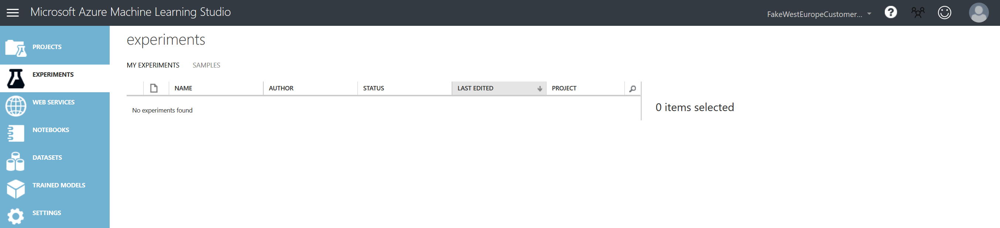
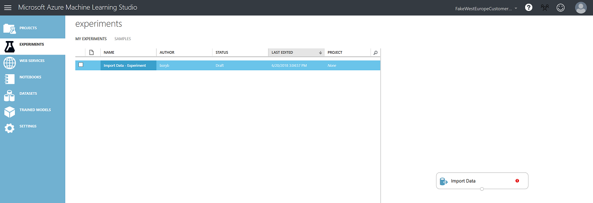
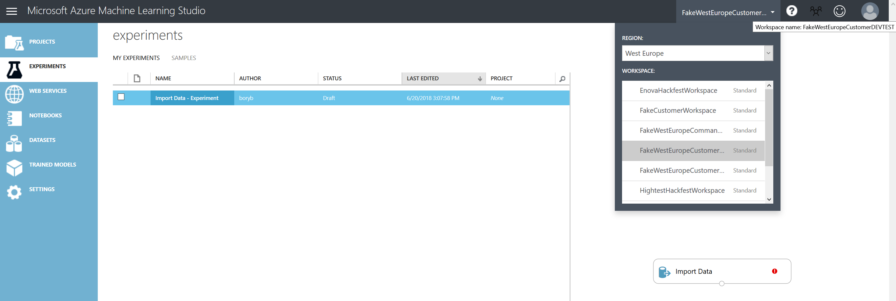
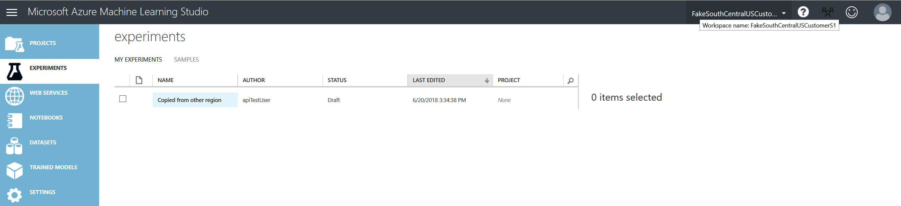
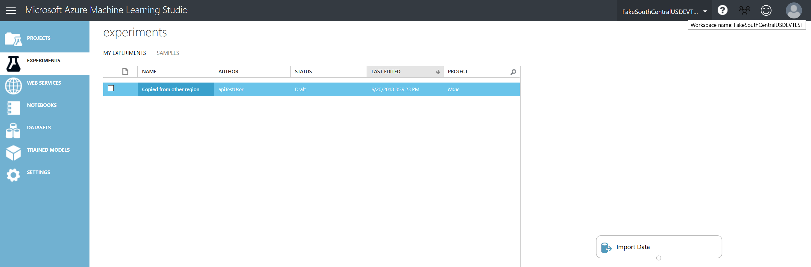
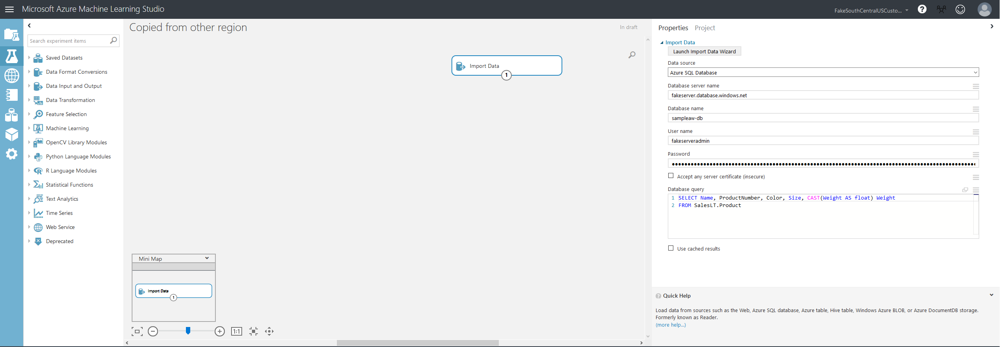

**Modify an experiment's node parameter value and overwriting the experiment:**

- **Modify Experiment**: *'Import Data - Experiment'*
- **Modified Node Name**: *'Import Data' //Found by comment "Import Data Comment"*
- **Modified Parameter Name**: *'Database Query'*

```csharp
static void ModifyExperimentNodeAndOverwrite(StudioClient studioClient)
{
    var workspace = new WorkspaceSettings()
    {
        WorkspaceId = "",
        AuthorizationToken = "",
        Location = "West Europe"
    };

    //var experiments = studioClient.GetExperiments(sourceWorkspace);
    var experimentId = "";
    var experiment = studioClient.GetExperiment(workspace, experimentId);

    studioClient.ModifyNodeParameter(workspace, experimentId, "Import Data Comment", "Database Query", "SELECT Name, ProductNumber, CAST(Weight AS float) Weight\r\nFROM SalesLT.Product");
}
```

**Modify an experiment's node parameter value and saving as a new experiment:**

- **Modify Experiment**: *'Import Data - Experiment'*
- **Modified Node Name**: *'Import Data' //Found by comment "Import Data Comment"*
- **Modified Parameter Name**: *'Database Query'*

```csharp
static void ModifyExperimentNodeAndSaveAsAnotherExperiment(StudioClient studioClient)
{
    var workspace = new WorkspaceSettings()
    {
        WorkspaceId = "",
        AuthorizationToken = "",
        Location = "West Europe"
    };

    //var experiments = studioClient.GetExperiments(sourceWorkspace);
    var experimentId = "";
    var experiment = studioClient.GetExperiment(workspace, experimentId);

    studioClient.ModifyNodeParameter(workspace, experimentId, "Import Data Comment", "Database Query", "SELECT Name, Color, CAST(Weight AS float) Weight\r\nFROM SalesLT.Product", "Import Data - Experiment 2");
}
```

From the portal's view:

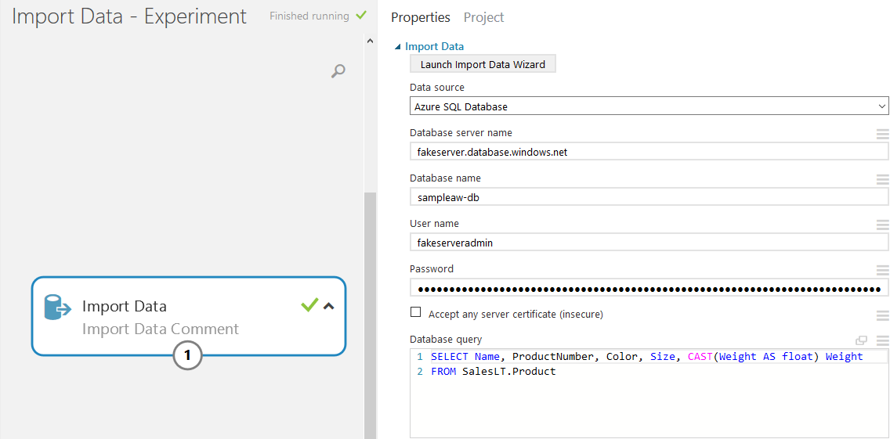
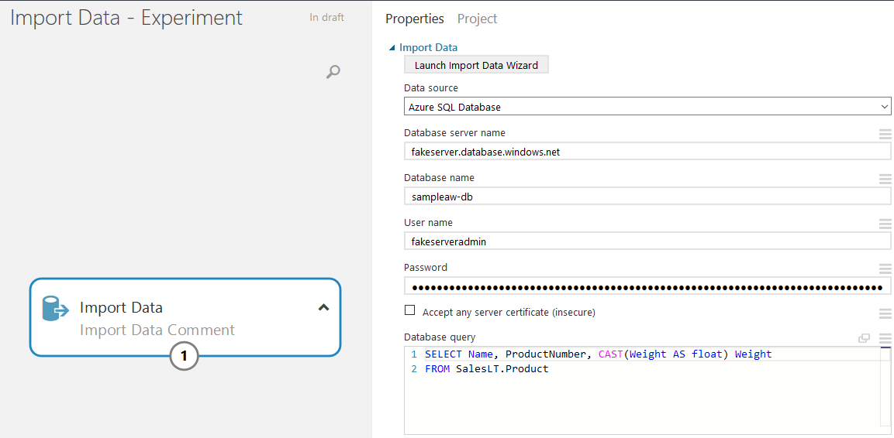
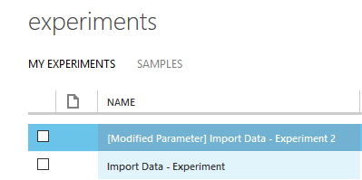
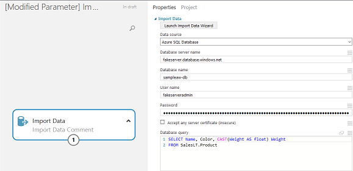

**Modify the connection within the modules (nodes) and overwriting the experiment:**

- **Modify Experiment**: *'Connect Modules - Experiment'

```csharp
static void ModifyConnectionWithinTheModulesAndOverwrite(StudioClient studioClient)
{
    var workspace = new WorkspaceSettings()
    {
        WorkspaceId = "",
        AuthorizationToken = "",
        Location = ""
    };

    //var experiments = studioClient.GetExperiments(sourceWorkspace);
    var experimentId = "";
    var experiment = studioClient.GetExperiment(workspace, experimentId);

    studioClient.ModifyNodeEdge(workspace, experimentId, "CSV", "Dataset");
}
```

**Modify the connection within the modules (nodes) and saving as a new experiment:**

- **Modify Experiment**: *'Connect Modules - Experiment'

```csharp
static void ModifyConnectionWithinTheModulesAndSaveAsAnotherExperiment(StudioClient studioClient)
{
    var workspace = new WorkspaceSettings()
    {
        WorkspaceId = "",
        AuthorizationToken = "",
        Location = ""
    };

    //var experiments = studioClient.GetExperiments(sourceWorkspace);
    var experimentId = "";
    var experiment = studioClient.GetExperiment(workspace, experimentId);

    studioClient.ModifyNodeEdge(workspace, experimentId, "CSV", "Dataset", "Connect Modules - Experiment 2");
}
```

Aaand from the portal's view:

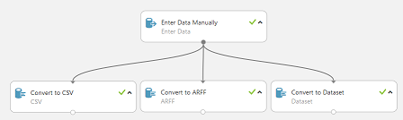
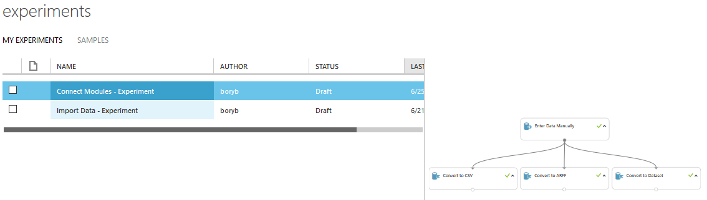
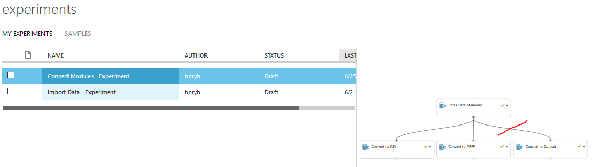
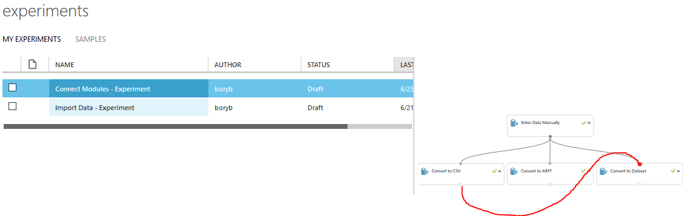
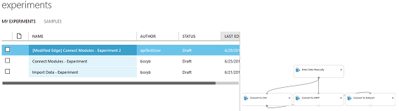

**Adding a new module to the experiment and overwriting it:**

- **Modify Experiment**: *'Add Module - Experiment'*

```csharp
static void AddModuleToTheExperimentAndOverwrite(StudioClient studioClient)
{
    var workspace = new WorkspaceSettings()
    {
        WorkspaceId = "",
        AuthorizationToken = "",
        Location = ""
    };

    //var experiments = studioClient.GetExperiments(sourceWorkspace);
    var experimentId = "";
    var experiment = studioClient.GetExperiment(workspace, experimentId);

    var nameOfNewModule = "";
    //nameOfNewModule hard-coded
    //TODO: make a dictionary of <Module Names, Module IDs>
    //EXAMPLES:
    //Convert to TSV: 506153734175476c4f62416c57734963.1cdbcda42ece49088b87e6b636258d3d.v1-default-1644
    //Convert to Dataset: 506153734175476c4f62416c57734963.72bf58e0fc874bb19704f1805003b975.v1-default-1642

    studioClient.AddModule(workspace, experimentId, nameOfNewModule);
}
```

**Adding a new module to the experiment and saving as a new one:**

- **Modify Experiment**: *'Add Module - Experiment'*

```csharp
static void AddModuleToTheExperimentAndSaveAsAnotherExperiment(StudioClient studioClient)
{
    var workspace = new WorkspaceSettings()
    {
        WorkspaceId = "",
        AuthorizationToken = "",
        Location = ""
    };

    //var experiments = studioClient.GetExperiments(sourceWorkspace);
    var experimentId = "";
    var experiment = studioClient.GetExperiment(workspace, experimentId);

    var nameOfNewModule = "";
    //nameOfNewModule hard-coded
    //TODO: make a dictionary of <Module Names, Module IDs>
    //EXAMPLES:
    //Convert to TSV: 506153734175476c4f62416c57734963.1cdbcda42ece49088b87e6b636258d3d.v1-default-1644
    //Convert to Dataset: 506153734175476c4f62416c57734963.72bf58e0fc874bb19704f1805003b975.v1-default-1642

    studioClient.AddModule(workspace, experimentId, nameOfNewModule, "Connect Modules - Experiment 2");
}
```

Source code of the website and portal's view:

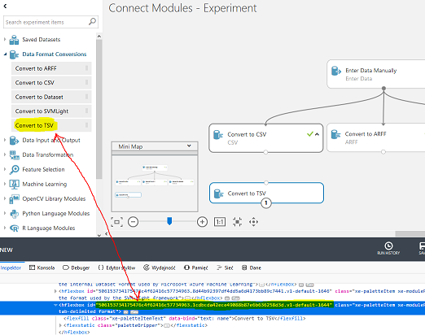
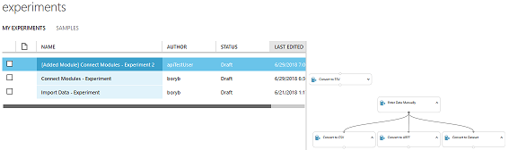

## Learnings

There are many thoughts that I have had during coding this solution.
Most of all it was hard to be consistent regarding naming
methods, classes, or even describing summaries of each instance.
I tried to be sure that the code that I have been creating would not be a spaghetti one.
The solution is still in development, and continuous support is needed!
For sure refactoring is a must in many aspects and few principles should be implemented.
Moreover, few methods are still a mystery for me,
and I left them behind in the SDK ([*ManagementService.cs*](AzureML.Studio.Core/Services/ManagementService.cs)) - you need to find them! 

What is more, I encountered several errors of the portal itself. These bugs are hidden somewhere in those copy/saving operations.

As I wrote at the begging - it is a pre-release version that contains many errors and not-handle exceptions
(implementation of these is on my TODO list).
Be aware!!!

Feel free to contribute, fork, modify, cooperate.
I hope this library will be helpful.

## Credits

- Borys Rybak - Software Development Engineer, Microsoft:
  - AzureMLSDK (source: [azuremlps](https://github.com/hning86/azuremlps/blob/master/code/AzureMLSDK.cs) by [Hai Ning](https://github.com/hning86)) small refactor into *AzureML.Studio.Core*
  - Entire solution of *AzureMachineLearningStudio*
    - *AzureML.Studio*
    - *AzureML.Studio.ConsoleApplicationExample*
    - *AzureML.Studio.Core*
    - [In Progress] *AzureML.Studio.Test*

## Helpful Materials

- [Framework Design Guidelines](https://docs.microsoft.com/en-us/dotnet/standard/design-guidelines/index)
- [Names of Assemblies and DLLs](https://docs.microsoft.com/en-us/dotnet/standard/design-guidelines/names-of-assemblies-and-dlls)
- [.NET Standard implementation support](https://docs.microsoft.com/en-us/dotnet/standard/net-standard#net-platforms-support)
- [StyleCop analyzes C# source code](https://github.com/StyleCop)
- [Unit testing C# in .NET Core using dotnet test and xUnit](https://docs.microsoft.com/en-us/dotnet/core/testing/unit-testing-with-dotnet-test)
