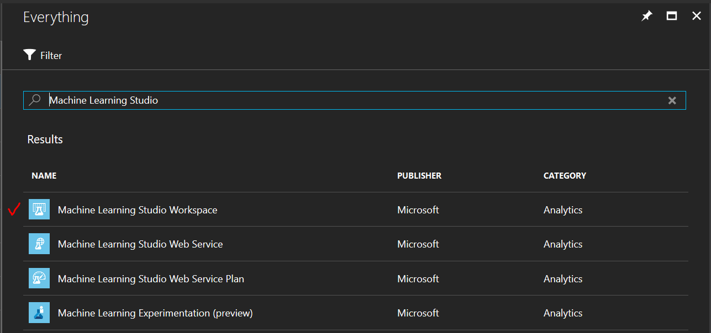
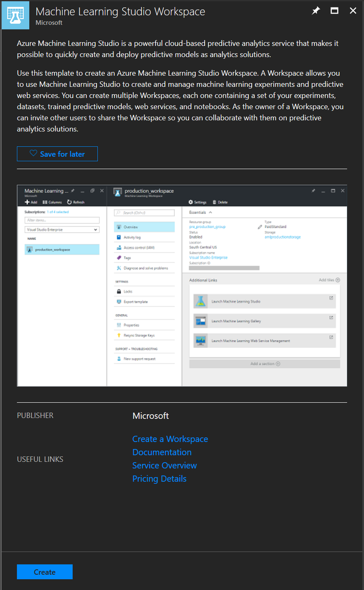
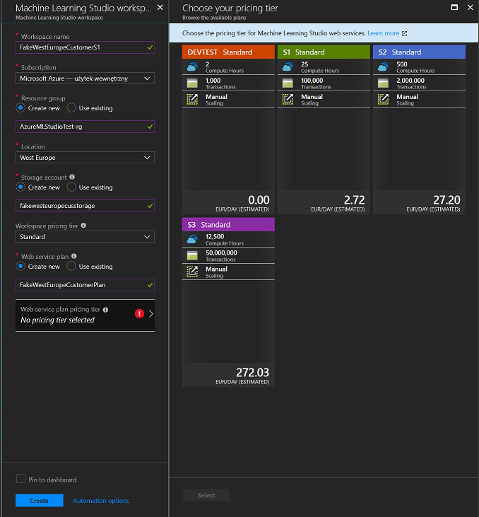
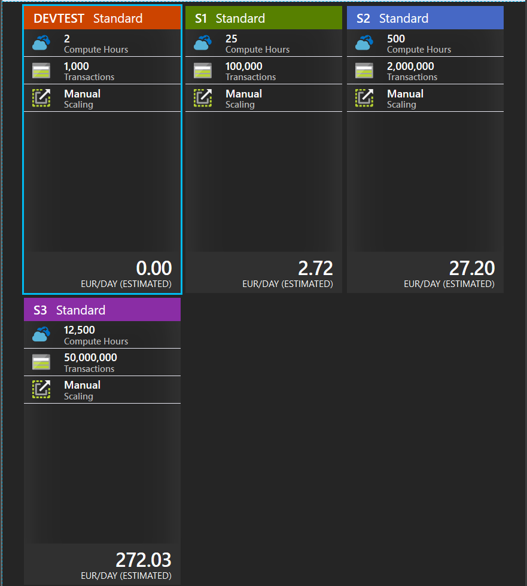

# .NET DLLs for Azure Machine Learning Studio management

## Overview

### Description

This repository contains a proof of concept project for **[Azure Machine Learning Studio](https://docs.microsoft.com/en-us/azure/machine-learning/studio/what-is-ml-studio)** management.

The solution includes **[.NET Standard 2.0](https://docs.microsoft.com/en-us/dotnet/standard/net-standard)** Class Libraries (*DLLs*),
which can be incorporated in many .NET applications and be used for scale and automate Azure ML Studio workspaces and experiments.

:construction: At the moment, the project is in the pre-release phase - __be aware of possible errors and exceptions before using it!__ :construction:

### Solution Base Overview

The idea of creating a tool to manage Azure Machine Learning Studio was born during the meeting with our partner **[Soneta/Enova365](https://www.enova.pl/en/)**.

Our partner was looking for solutions that could help automate and scale experiments in Azure ML Studio portal.
After the initial analysis of the available tools, I discovered the only one
that I used later as a base for the current solution
(*source: [PowerShell Module for Azure Machine Learning Studio & Web Services](https://github.com/hning86/azuremlps)*) - this solution was developed for PowerShell users, and the C# code implementation (SDK) helped me as a base to create this project.

## Table of Contents

- [Project](#net-dlls-for-azure-machine-learning-studio-management)  
- [Overview](#overview)  
  - [Description](#description)  
  - [Solution Base Overview](#solution-base-overview)  
- [Table of Contents](#table-of-contents)  
- [Prerequisites](#prerequisites)
  - [Azure Machine Learning Studio](#azure-machine-learning-studio)
    - [Free Workspace](#free-workspace)
    - [Azure Subscription](#azure-subscription)
  - [Software](#software)
  - [Tools & Libraries](#tools-libraries)
- [Usage](#usage)
- [Testing](#testing)
- [Learnings](#learnings)
- [Credits](#credits)
- [Helpful Materials](#helpful-materials)

## Prerequisites

### Azure Machine Learning Studio

This solution was created for the use of Azure Machine Learning Studio resources - *Workspace, Experiment, Database, Modules, etc.*
We need a proper account to be able to work by using this library.

We can create different types of workspaces, because our library should deal with any type of account.

#### Free Workspace

Visit the main website of Azure Machine Learning Studio and simply create a new account - https://studio.azureml.net/

You should notice this:

#### Azure Subscription

Alternatively, create an Azure Account with a subscription.

- [Azure Free Account](https://azure.microsoft.com/en-us/offers/ms-azr-0044p/)
- [Azure for Students](https://azure.microsoft.com/en-us/free/students/)
- [Azure Pass](https://www.microsoftazurepass.com/Home/HowTo)

And create a workspace withing the portal:

### Software

***AzureML.Studio.dll*** and ***AzureML.Studio.Core.dll*** are class libraries written in .NET Standard 2.0 .

*"The .NET Standard is a formal specification of .NET APIs that are intended to be available on all .NET implementations.
The motivation behind the .NET Standard is establishing greater uniformity in the .NET ecosystem.
ECMA 335 continues to establish uniformity for .NET implementation behavior,
but there is no similar spec for the .NET Base Class Libraries (BCL) for .NET library implementations."*

You can use these DLLs in particluar, however before using concider the following table of all versions of .NET Standard and the platforms supported (*source: [.NET Standard](https://docs.microsoft.com/en-us/dotnet/standard/net-standard#net-platforms-support)*):

| **.NET Standard**             | **1.0** | **1.1** | **1.2** | **1.3** | **1.4** | **1.5** | **1.6** | **2.0** |
| :---------------------------- | :-----: | :-----: | :-----: | :-----: | :-----: | :-----: | :-----: | :-----: |
| .NET Core                     | 1.0     |	1.0 	| 1.0 	  | 1.0 	| 1.0 	  | 1.0 	| 1.0 	  | 2.0     |
| .NET Framework                | 4.5     |	4.5     | 4.5.1   | 4.6     | 4.6.1   |	4.6.1   | 4.6.1   |	4.6.1   |
| Mono                          | 4.6     |	4.6     | 4.6 	  | 4.6     | 4.6     |	4.6     | 4.6     |	5.4     |
| Xamarin.iOS                   | 10.0    |	10.0    | 10.0    |	10.0    | 10.0    |	10.0 	| 10.0    |	10.14   |
| Xamarin.Mac                   | 3.0     |	3.0     | 3.0     |	3.0     | 3.0     |	3.0 	| 3.0     |	3.8     |
| Xamarin.Android               | 7.0 	  | 7.0     | 7.0 	  | 7.0 	| 7.0     |	7.0     | 7.0     |	8.0     |
| Universal Windows Platform    | 10.0    | 10.0    | 10.0    | 10.0    | 10.0 	  | 10.0.16299 | 10.0.16299 | 10.0.16299 |

### Tools & Libraries

## Usage

## Testing

## Learnings

## Credits

## Helpful Materials

- [Framework Design Guidelines](https://docs.microsoft.com/en-us/dotnet/standard/design-guidelines/index)
- [Names of Assemblies and DLLs](https://docs.microsoft.com/en-us/dotnet/standard/design-guidelines/names-of-assemblies-and-dlls)
- [.NET Standard implementation support](https://docs.microsoft.com/en-us/dotnet/standard/net-standard#net-platforms-support)
- [StyleCop analyzes C# source code](https://github.com/StyleCop)
- [Unit testing C# in .NET Core using dotnet test and xUnit](https://docs.microsoft.com/en-us/dotnet/core/testing/unit-testing-with-dotnet-test)
